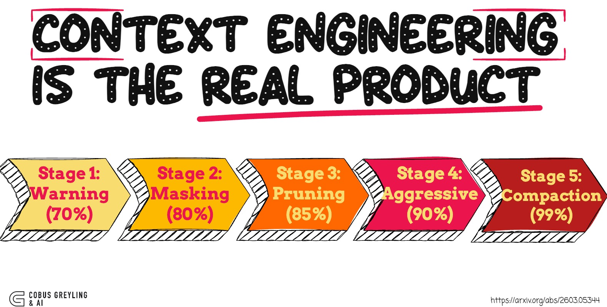

# Context Engineering Is the Real Product



Blog post and interactive demo exploring context engineering patterns from the [OpenDev technical report](https://arxiv.org/abs/2603.05344) — the first comprehensive paper documenting the architecture of an open-source, terminal-native coding agent.

## Summary

Most AI agent failures aren't reasoning failures — they're context failures. The model forgot its instructions, the context window filled with verbose tool outputs, or the agent stopped following its system prompt after 20 tool calls. Context engineering solves all three.

This repo accompanies a blog post that distils the key context engineering patterns from the OpenDev paper:

- **5-Stage Adaptive Context Compaction** — A progressive pipeline (70% → 80% → 85% → 90% → 99% pressure thresholds) that reclaims token budget using increasingly aggressive strategies, from observation masking to full LLM summarisation. Cheaper strategies often reclaim enough space on their own.
- **Tool Result Optimisation** — Compressing raw tool outputs (30,000 tokens → ~100 tokens) at ingestion while keeping full content recoverable on demand.
- **System Reminders** — Event-driven reminders injected as `role: user` messages at decision points to combat instruction fade-out, which reliably occurs after ~15 tool calls.
- **Doom-Loop Detection** — Fingerprinting repeated tool calls to break cycles before they waste the context budget.
- **Compound Model Architecture** — Routing five distinct roles (action, thinking, critique, vision, compaction) to different LLMs optimised for each task.

These patterns are what separate agents that work for 5 turns in a demo from those that work for 40+ turns in production.

## Interactive Demo

The included Gradio app simulates a multi-turn coding agent session demonstrating the compaction pipeline, tool result optimisation, and system reminders in action. No API key needed.

```bash
pip install gradio
python context_engineering_demo.py
```

## Files

| File | Description |
|------|-------------|
| `context_engineering_blog.md` | Full blog post |
| `context_engineering_demo.py` | Interactive Gradio demo app |

## Author

**Cobus Greyling**

## References

- [OpenDev Technical Report (arXiv:2603.05344)](https://arxiv.org/abs/2603.05344)
