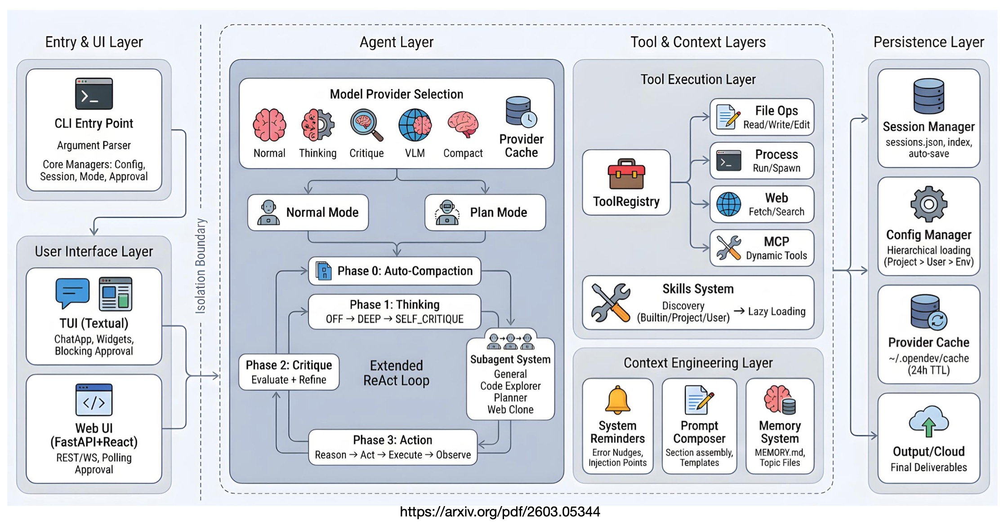

# Context Engineering Is the Real Product

Your AI coding agent isn't as smart as you think. It's as well-managed as someone engineered its context to be.


## In Short

I've been reading the OpenDev technical report, the first comprehensive paper documenting the architecture of an open-source, terminal-native coding agent (written in Rust). 81 pages. The detail is exceptional.

What stood out isn't the model. It's not the tools. It's the context engineering.

OpenDev treats the context window as a finite, depletable resource, like memory in an operating system. They built a 5-stage adaptive compaction pipeline that progressively reclaims token budget as pressure rises. The result: sessions that last 40+ turns instead of dying at 15.

Most agent failures aren't reasoning failures. They're context failures. The model forgot its instructions. The context window filled up with verbose tool outputs. The agent stopped following its system prompt after 20 tool calls. Context engineering solves all three.

If you're building agents, this is the layer that separates demos from production.

[OpenDev Paper (arXiv:2603.05344)](https://arxiv.org/abs/2603.05344)

## Why Context Engineering Matters

Here's the uncomfortable truth about LLM-based agents: the model sees exactly what you put in front of it. Nothing more.

Every file read, every search result, every command output, all of it goes into a fixed-size window. A single test suite output can consume 30,000 tokens. A few large file reads and your context is full. The agent stops being effective not because it got dumber, but because the important information got buried under noise.

The OpenDev paper frames this precisely: **context is a budget, not a log**. Every token you spend on a stale tool output is a token you can't spend on the user's actual question.

## The 5-Stage Adaptive Context Compaction Pipeline

This is the centrepiece of the paper's context engineering. Instead of a binary "context full → emergency summarise" approach, OpenDev monitors context pressure continuously and applies progressively aggressive strategies:

```
Context Pressure    Strategy                What Happens
─────────────────────────────────────────────────────────────
70%                 Warning                 Log pressure, start tracking trends
80%                 Observation Masking      Replace old tool results with compact
                                            reference pointers (~15 tokens each)
85%                 Fast Pruning             Delete old tool outputs beyond recency
                                            window (cheaper than LLM summarisation)
90%                 Aggressive Masking       Shrink preservation window to only
                                            the most recent tool outputs
99%                 Full Compaction          LLM-based summarisation of middle
                                            conversation, preserve recent verbatim
```

The key insight: **cheaper strategies often reclaim enough space**, avoiding the cost and information loss of full LLM summarisation. Stage 2 alone (observation masking) reduces tool output tokens from thousands to ~15 per observation.

Before this pipeline existed, sessions hit context overflow at 15-20 turns. After: 30-40 turns without compaction even being triggered.

## Tool Result Optimisation: 30,000 Tokens → 100

Raw tool outputs are absurdly wasteful. A `read_file` returns thousands of tokens of source code. A directory listing enumerates hundreds of entries. A test runner produces pages of TAP output.

OpenDev compresses these at ingestion:

- **File reads** → `"Read file (142 lines, 4,831 chars)"` (~15 tokens)
- **Search results** → `"Search completed (23 matches found)"` (~10 tokens)
- **Directory listings** → `"Listed directory (47 items)"` (~8 tokens)
- **Command outputs** over 8,000 chars → offloaded to scratch file with a reference pointer

The full content is always recoverable (the agent can re-read on demand), but the context carries only proof that the operation happened. This alone extended typical sessions from hitting overflow to running comfortably.

## System Reminders: Fighting Instruction Fade-Out

This is the part that surprised me most.

After about 15 tool calls, the model reliably stops following its system prompt. The instructions are still there in the context window. The model just stops paying attention. It's a distance problem: the system prompt sits at position 0, and the model's attention has shifted to the recent messages at position 50,000+.

The fix: **event-driven system reminders** injected as `role: user` messages (not `role: system`) at the exact decision point where the agent would otherwise go wrong.

Why `role: user`? Because after 40 turns, another system message blends into the background the model has already partially forgotten. A user message appears at maximum recency. The model treats it as something requiring a response.

Eight event detectors monitor conditions like:
- Tool failure without retry
- Exploration spirals (5+ consecutive reads without action)
- Incomplete tasks when agent signals completion
- Doom loops (same tool call 3+ times)

Each reminder type has a budget (e.g., max 3 nudges for error recovery, max 2 for incomplete todos). Once exhausted, the system accepts the agent's judgement rather than looping.

## The Compound Architecture: Right Model for the Right Job

OpenDev doesn't use one model for everything. Five distinct model roles route to different LLMs:

| Role | Purpose | Optimise For |
|------|---------|-------------|
| **Action** | Primary tool-based reasoning | Capability |
| **Thinking** | Extended reasoning without tools | Depth |
| **Critique** | Self-evaluation (Reflexion-inspired) | Accuracy |
| **Vision** | Screenshot/image processing | Multimodality |
| **Compact** | Summarisation during compaction | Speed + Cost |

This is why tools like Claude Code can work with different model providers. The architecture is **model-agnostic by construction**: each workflow independently selects its model via configuration. Switching from Anthropic to OpenAI to Fireworks requires a config change, not a code change. Provider-specific prompt sections adapt the system prompt based on which LLM is active.

## Lessons From the Paper

A few of the battle-tested lessons that resonated:

**"Context is a budget, not a log."** Every message competes for finite space. Treat additions as spending, not recording. Track what is consuming context and whether it's still paying for itself.

**"Steer behaviour at decision points, not at boot time."** A long system prompt at the start fades. A short reminder right before the decision sticks.

**"Bound every resource that grows with session length."** Undo history, concurrent tool calls, behavioural nudges, everything needs a cap. Without one, long sessions inevitably fail.

**"Prefer empirical threshold tuning over first-principles calculation."** The 70% compaction trigger, 3 nudge attempts, 6 thinking depth levels all emerged from observing failure modes, not from theory.

## The Demo

The accompanying demo app implements a simplified version of the 5-stage context compaction pipeline with tool result optimisation and system reminders. It simulates a multi-turn coding agent session where you can watch context pressure rise, see compaction stages activate, and observe how reminders maintain agent behaviour over long conversations.

Run it:
```bash
pip install gradio
python context_engineering_demo.py
```

No API key needed. The demo uses simulated LLM responses to demonstrate the context management mechanics themselves, which is the point.



## Bottom Line

The model is the commodity. The context engineering is the product.

Every agent builder is going to hit these same problems: context overflow, instruction fade-out, verbose tool outputs, doom loops. The patterns documented in this paper, adaptive compaction, tool result optimisation, event-driven reminders, doom-loop detection, are not nice-to-haves. They're the difference between an agent that works for 5 turns in a demo and one that works for 40 turns in production.

The OpenDev paper is the most detailed open documentation of these patterns I've seen. If you're building agents, read it.
